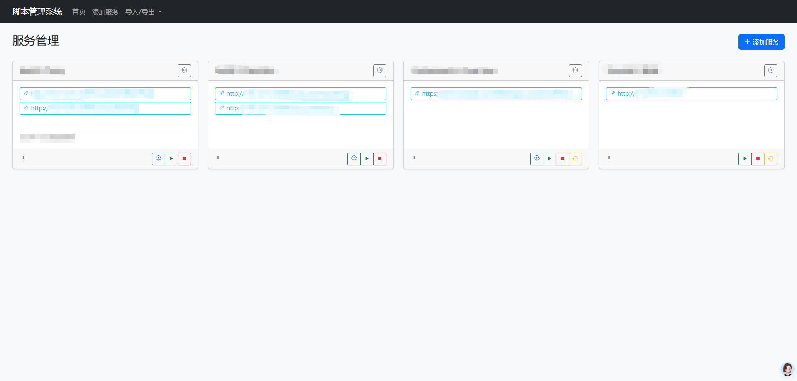
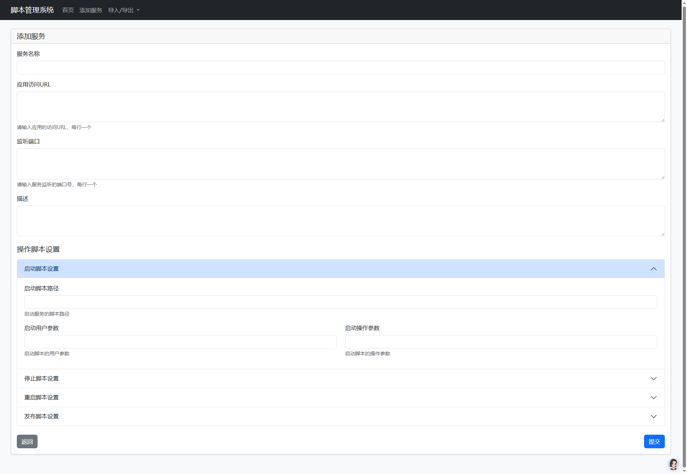

# 脚本管理系统

这是一个简单的脚本管理系统，允许用户上传、运行、编辑和删除脚本。系统支持脚本排序和状态监控功能。

## 功能特点

- 脚本上传与管理
- 脚本执行与状态监控
- 拖拽排序功能
- 脚本编辑与删除

## 技术栈

- 后端：Python Flask
- 前端：HTML, CSS, JavaScript
- 数据库：SQLite
- UI框架：Bootstrap

## 截图展示

### 主界面

### 脚本执行

## 安装步骤

### 前提条件

- Python 3.7+
- pip (Python包管理器)

### 安装过程

1. 克隆仓库
bash
git https://github.com/tonyleecn/web-shell-runner.git
cd web-shell-runner

2. 安装依赖
bash
pip install -r requirements.txt

3. 运行项目
bash
python app.py

或

bash
./start.sh

