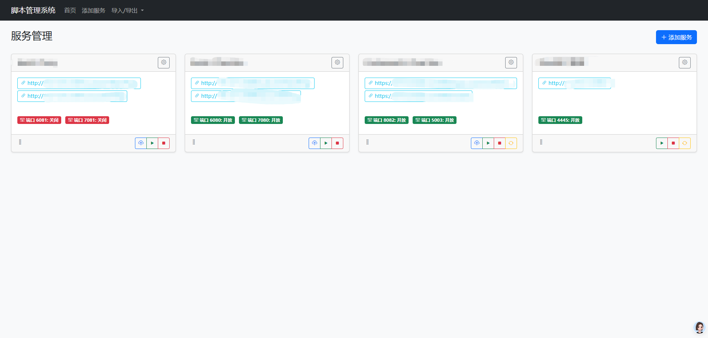

# 脚本管理系统

这是一个简单的服务器脚本（.sh文件）运行系统，允许用户执行服务器脚本，并查看执行结果。程序未经详细测试，用来测试服务的发布，请勿在生产环境中使用。解决运行脚本环境不同导致脚本运行错误。

## 功能特点

- 服务脚本执行
- 拖拽排序功能

## 技术栈

- 后端：Python Flask
- 前端：HTML, CSS, JavaScript
- 数据库：SQLite
- UI框架：Bootstrap

## 截图展示

### 主界面

### 脚本执行

## 安装步骤

### 前提条件

- Python 3.7+
- pip (Python包管理器)

### 安装过程

1. 克隆仓库
bash
git https://github.com/tonyleecn/web-shell-runner.git
cd web-shell-runner

2. 安装依赖
bash
pip install -r requirements.txt

3. 运行项目
bash
python app.py

或

bash
./start.sh

